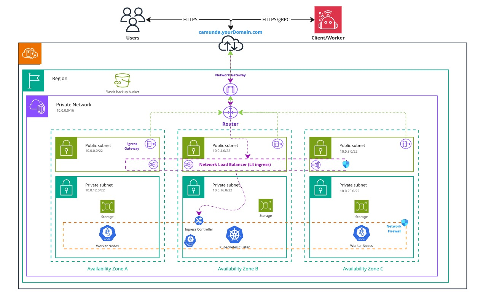
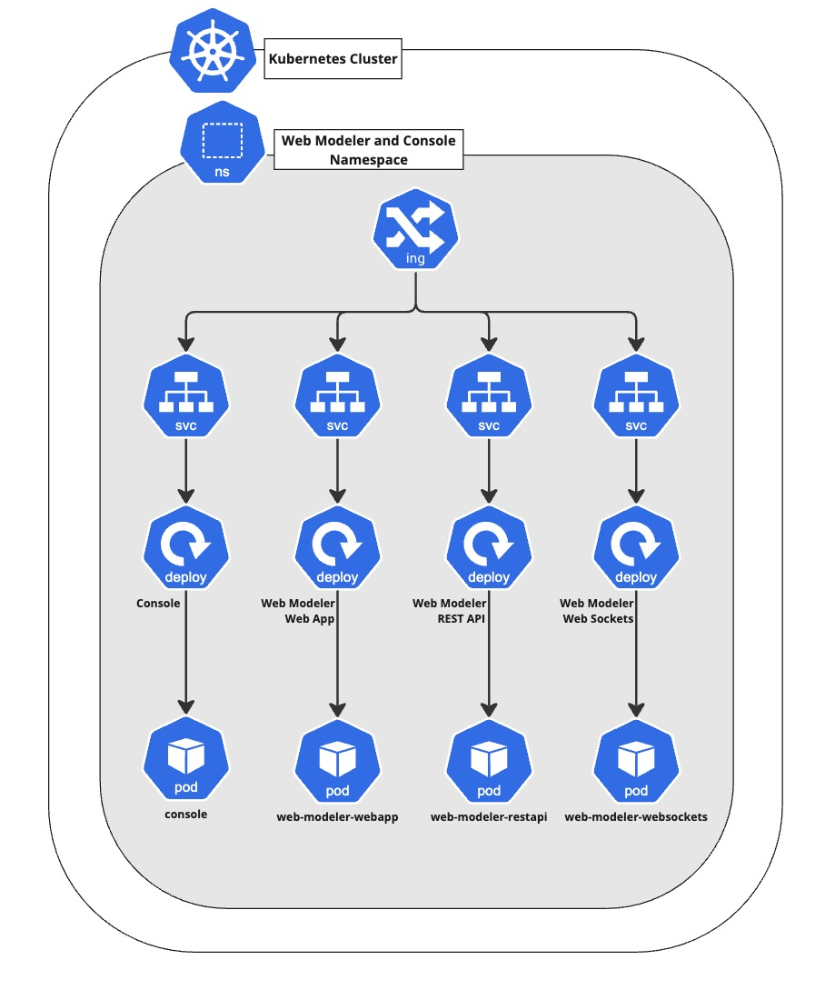

This reference architecture provides guidance on deploying Camunda 8 Self-Managed within a Kubernetes cluster. This deployment method is ideal for users who are looking to leverage the benefits of containerization and self-healing capabilities. It's well suited to quickly scale and easily provide resilience by utilizing multi zone deployments.

## Key features

- **Scalability & High Availability**: Camunda 8 can easily be scaled up and down depending on your demand, as well as provide a highly available setup.
- **Fault Tolerance & Resilience**: With the previous key feature, also better resilience comes along as you can scale Camunda 8 across zones or across regions to provide greater fault tolerance and uptime for your workflows.

Although Kubernetes has a **steeper learning curve**, once properly configured, it provides significant advantages, including **self-healing capabilities** that ensure application resilience by automatically restarting failed containers and rescheduling workloads.

Additionally, Kubernetes benefits from a vast ecosystem of **[Cloud Native Computing Foundation (CNCF) projects](https://www.cncf.io/)**, offering seamless integration with monitoring, observability, logging, and security solutions. Tools like **Prometheus and Grafana** allow for comprehensive monitoring, while service meshes such as **Istio** enhance traffic management and security.

By leveraging this **rich ecosystem**, organizations can **extend Kubernetes functionality** to meet their specific operational needs, enabling greater automation, scalability, and visibility across their infrastructure.

## Reference implementations

This section includes deployment reference architectures for manual setups:

- [Amazon EKS single-region](/versioned_docs/version-8.7/self-managed/setup/deploy/amazon/amazon-eks/terraform-setup.md) - a standard production setup.
- [Amazon EKS dual-region](/versioned_docs/version-8.7/self-managed/setup/deploy/amazon/amazon-eks/dual-region.md) - advanced use case by utilizing two regions.

## Considerations

## Architecture

_Infrastructure diagram for a single region setup (click on the image to open the PDF version)_

This Kubernetes architecture diagram illustrates a high-availability setup spanning multiple availability zones (A, B, and C) with key networking components to ensure scalability, security, and reliability. Whenever possible, we recommend leveraging multiple availability zones to enhance fault tolerance and eliminate single points of failure.

For controlled access, we suggest deploying Camunda 8 within a private subnet while managing incoming traffic through an ingress and load balancer.

The database is not depicted in the diagram, as we recommend handling it externally from the Kubernetes cluster. The implementation depends on organizational requirements, often residing within the same private network or even the same private subnets. Many companies maintain dedicated database setups, granting access only as needed.

This provides a simplified view of a deployment using the [Camunda 8 Helm chart](/versioned_docs/version-8.7/self-managed/setup/install.md). To keep the diagram clear, we have omitted ConfigMaps, Secrets, RBAC, and ReplicaSets.

By default, the Helm chart suggests using a single ingress for Camunda resources, enabling a unified domain with each application accessible via a different path.

Most applications are stateless and deployed as **Deployments**. However, Zeebe Brokers are an exception, requiring a **StatefulSet** to ensure that volumes are consistently mounted, as pod order and identifiers are crucial.

Zeebe Brokers also have a service but are not directly exposed externally; all requests must pass through the Zeebe Gateway, which is typically used for internal communication as well.

Web Modeler and Console are deployed as **Deployments** since they are stateless, with data stored externally in a SQL database. This allows them to be easily scaled as needed.

---

This does not provide detailed information on application communication. For a general overview, refer to the [overview page](/versioned_docs/version-8.7/self-managed/reference-architecture/reference-architecture.md#architecture).

### High Availability (HA)

:::caution Non-HA importer / archiver
The following concerns, **Operate**, **Tasklist**, and **Optimize**.
When scaling from a single pod to multiple, ensure that the `importer / archiver` is enabled on only one pod and disabled on others. Enabling it on multiple pods will cause data inconsistencies. This limitation is known and will be addressed in future updates.
:::

For high availability, a minimum of four Kubernetes nodes are recommended to ensure fault tolerance and support master election in case of failures. To learn more about the Raft protocol and clustering concepts, refer to the [clustering documentation](/versioned_docs/version-8.7/components/zeebe/technical-concepts/clustering.md).

In Kubernetes, Deployments and StatefulSets can be scaled independently of physical machines. However, the recommendation of at least fours Kubernetes nodes is based on the default setup of a three-broker Zeebe deployments and all the other WebApps (Operate, Tasklist, Optimize, ...). The idea of four nodes allows enough resources to schedule all Camunda 8 components. This is based on a default setup, your setup may differ and requires you to either scale more horizontally or vertically to ensure enough capacity depending on your Camunda 8 usage.

Additionally, the default node affinity settings prevent Zeebe brokers from being scheduled on the same node, necessitating a minimum three-node setup. For more details on Kubernetes affinity rules, see the [official documentation](https://kubernetes.io/docs/concepts/scheduling-eviction/assign-pod-node/).

To further enhance fault tolerance, it is recommended to distribute Zeebe brokers and other scaled applications across multiple availability zones using additional affinity rules, ensuring resilience in case of a zone failure.

### Components

We typically distinguish as mentioned in the [Reference Architecture Overview](/versioned_docs/version-8.7/self-managed/reference-architecture/reference-architecture.md#architecture) between the **Orchestration cluster** and the **Web Modeler and Console**. Those should be separated by utilizing [Kubernetes namespaces](https://kubernetes.io/docs/concepts/overview/working-with-objects/namespaces/). While they could also run within a single namespace, the idea is that **Web Modeler and Console** are not limited to a single **Orchestration cluster**, therefore allowing duplicating the **Orchestration cluster** based on different use cases and requirements, while the other two are independent from it and don't need to be scaled out in the same way and could house a multitude of teams and use cases.

The **Orchestration cluster** namespace consists as outlined in the [architecture diagram](#architecture) of the following components:

- [Zeebe Brokers](/versioned_docs/version-8.7/components/zeebe/technical-concepts/architecture.md#brokers)
- [Zeebe Gateway](/versioned_docs/version-8.7/self-managed/zeebe-deployment/zeebe-gateway/zeebe-gateway-overview.md)
- [Operate](/versioned_docs/version-8.7/components/operate/operate-introduction.md)
- [Tasklist](/versioned_docs/version-8.7/components/tasklist/introduction-to-tasklist.md)
- <!-- TODO: fix link [Optimize](/optimize_versioned_docs/version-3.15.0/components/what-is-optimize.md) -->
- [Identity](/versioned_docs/version-8.7/self-managed/identity/what-is-identity.md)
- [Connectors](/versioned_docs/version-8.7/components/connectors/introduction.md)

The **Web Modeler and Console** namespace consists as outlined in the [architecture diagram](#architecture) of the following components:

- Web Modeler <!-- TODO: we don't even have a page on this, since it was originially just a SaaS product -->
- [Console](/versioned_docs/version-8.7/self-managed/console-deployment/overview.md)

Ideally Web Modeler and Console are connected to either the same Identity as the **Orchestration cluster** or their own Identity instance but everyone utilizing the same OIDC connection.

## Requirements

### Infrastructure

First off, we recommend an officially [certified Kubernetes](https://www.cncf.io/training/certification/software-conformance/#benefits) distribution.

Camunda 8 itself is not bound to a Kubernetes version. We do provide a [Helm Chart](/versioned_docs/version-8.7/self-managed/setup/install.md) to support an easy installation on Kubernetes. The Helm Chart is generally compatible with the [official support cycle](https://kubernetes.io/releases/) of Kubernetes.

Any of the following are just suggestions for the minimum viable setup, the sizing heavily depends on your use cases and usage. It is recommended to understand the documentation on [sizing your environment](/versioned_docs/version-8.7/components/best-practices/architecture/sizing-your-environment.md), [Zeebe resource planning](/versioned_docs/version-8.7/self-managed/zeebe-deployment/operations/resource-planning.md), and run benchmarking to confirm your required needs.

#### Minimum cluster requirements

- `4` Kubernetes Nodes
  - Modern CPU: `4 Cores`
  - Memory: `16 GiB`
- Persistent Volumes
  - `1,000 IOPS`
  - <!-- TODO: check minimal disk size based on what the helm chart does -->

#### Networking

### Application

### Database

## Cloud specifics

### Amazon AWS

### Microsoft Azure

### Google GCP
